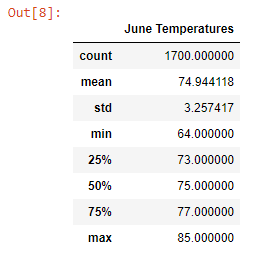
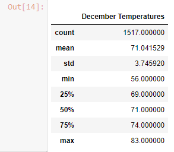
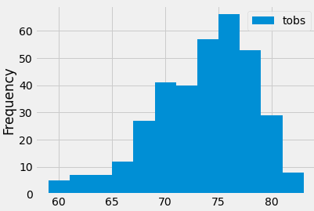
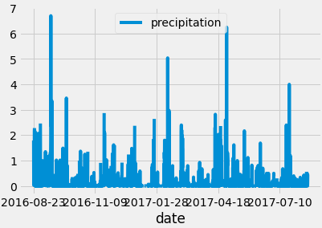

# Surfs_Up

## Overview of the Analysis
In this project, I examined weather patterns in Oahu, Hawaii to determine the best spot to open a local surfboard and icecream shop. I sifted through data entries like weather pattens, temperature, and average rainfall to see if this venture would work. I even went as far as to narrow my search of average temperature to the radar with the most data entries. In addition, I broke down even further and dove into temperature ranges for specific months. The results will be explained in the paragraphs to come.

## Results
One of the major questions brought to me was how the distribution of temperatures were in the months of June and December. These months are important because they represent one of the coldest months and one of the warmest months in Hawaii. Understanding the temperature range could provide insight into if we should worry about the colder months. Some of the results I found were:

- The average temperature during June and December was similar. In June the average temperature was 74.9F, while the average temperature in December was 71.0F. The varation in average temperature between these months is minimal.

- Although the average teemperature is veery similair in both months (June and December) is very similar, the minimum temperature recorded in December was much colder than in June. In December the minimum temperature recorded was 56F, whilst in June the minimum temperature recorded was 64F. If the temperature were to reach this low (56F) in December, sales would most certainly fall for that day.

- One last thing I wanted to address was model accuracy and reliablility. In both the models run, for Demember and June over 1,500 temperture recordings were taken. This means over 50 recordings were taken each day. For this reason, I think it is safe to say that the data and assumptions I have put worth today are complete and backed up by hard evidence.

The results of the temperatures in June and December are shown below.

           

## Summary
From this dataset, it can be seen that temperature variation in Hawaii is qute low. The island tends to have good weather (hovering at an average temperature around 71F-75F). For this reason, I think this would be a great location to open up shop for a surfboard and icecream store. The amount of temperature recordings taken during these time periods were extremely high, so we can trust that the data is accurate. In addition, the ranges during these months in terms of temperature is relatively low. Therefore, we can conclude that this business would do rather well in this location. In addition, I thought these two images below would be quite useful for our analysis. One shows how frequent good weather is on the island. The other image shows rainfall on the island. From the temperatures, it can be seen that temperature about 70F is extremely common. In respect to the rainfall chart, we can also see that the amount of rainfall each season is spread throughout and pretty random.

              

During this analysis, the applications used to develop these results were Python, Jupyter Notebook, SQLite, SQLAlchemy, and Flask.
